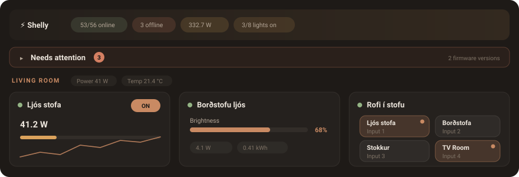

# HA Device Dashboard




[](https://github.com/hacs/integration)
[](https://github.com/TheIcelandicguy/ha-device-dashboard-card/releases)


A Home Assistant Lovelace custom card that auto-discovers your devices and renders
them as a live, device-centric fleet dashboard — grouped by room, with real
controls, sensor chips, sparkline graphs and an expandable detail panel per device.

Shelly and BTHome devices are discovered by default with full model-aware
detection. Switch to **universal mode** and it discovers every device in Home
Assistant — ZHA, Z-Wave, Hue, ESPHome, Matter, Tasmota, anything.

Frontend only: no custom integration, no Python, no helper entities.

---

## Features

- **Auto-discovery** — reads the HA device and entity registries; no manual entity list
- **Two discovery modes** — Shelly/BTHome only (default), or every HA device with
  scoping controls to tame the firehose
- **Device profiles** — relay, plug, dimmer, RGB, cover/roller, valve, TRV, Wall
  Display, energy monitor, sensor, input (i3/i4), UNI, lock, media player, generic
- **Room grouping** — one collapsible section per HA area, with per-room summary chips
- **Real controls on the tile** — toggles, per-channel relays, brightness and colour,
  cover open/stop/close + position, TRV setpoint, valve position
- **Tile styles** — an adaptive block tile plus six purpose-built layouts
  (power monitor with five variants, light, climate, cover, sensor, scene button)
- **Expandable detail sheet** — click a tile for all entities, history tabs,
  diagnostics, firmware, IP, RSSI and uptime
- **Sparkline graphs** — per-metric labelled graphs with time axis, peak/min markers,
  hover tooltips and a tick grid; line, area or bar
- **Energy windows** — every energy chip can show the lifetime total or consumption
  today / this week / this month, computed from recorder statistics (no helpers)
- **Views** — filtered tabs over the same fleet, each with its own layout overrides
- **Deep styling cascade** — three family ladders (tile: device → type → room →
  view → card; container: room → view → card; chrome: view → card), eight built-in
  themes plus **Follow HA**, all edited from one scope-first **Design** tab
- **Import from Shelly Cloud** — coming from the Shelly app? One paste of your
  cloud key pulls each room's photo and the official product image for every
  device onto the matching tiles
- **Embed your own cards** — any Lovelace card above, below, or inside a room
- **Visual editor** — full GUI editor with an Advanced toggle and a read-only YAML tab

---

## Installation

**Requires** Home Assistant **2024.8 or newer** (declared in `hacs.json`).
Developed and tested against HA 2026.8; if you hit trouble on an older
version, please say which version in the issue.

### HACS

1. HACS → **Custom repositories**
2. Add `https://github.com/TheIcelandicguy/ha-device-dashboard-card` — category **Dashboard**
3. Install **HA Device Dashboard**, then hard-refresh the browser

HACS registers the resource for you. If you need it by hand, it is:

- URL `/local/community/ha-device-dashboard/ha-device-dashboard.js`
- Type **JavaScript Module**

### Manual

1. Download `dist/ha-device-dashboard.js`
2. Copy it to `/config/www/community/ha-device-dashboard/ha-device-dashboard.js`
3. **Settings → Dashboards → Resources → Add**, using the URL and type above
4. Hard-refresh

The bundle prints a build tag to the browser console on load — use it to confirm
which build HA actually has after an update.

---

## Quick start

```yaml
type: custom:ha-device-dashboard
```

That is a complete config — everything else is optional:

```yaml
type: custom:ha-device-dashboard
title: Home
columns: 3
tile_size: md
sort_by: name
smart_tile_styles: true      # per-profile tile layouts instead of the adaptive one
energy_period: today         # energy chips show today's consumption
areas:
  - Living Room
  - Kitchen
sensors:
  - power
  - temperature
  - battery
graph_sensors:
  - power
  - temperature
graph_hours: 24
```

---

## Discovery

**This is the setting behind almost every "my device isn't showing" question.**
The card ships in Shelly mode.

```yaml
mode: universal          # discover every HA device
universal_scope: devices # devices | controllable | all
```

| Option | Type | Default | Description |
|---|---|---|---|
| `mode` | `shelly` \| `universal` | `shelly` | `shelly` keeps only Shelly + BTHome devices (and drops BTHome devices from other vendors). `universal` discovers everything; Shelly devices keep their full-fidelity detection either way. |
| `universal_scope` | `devices` \| `controllable` \| `all` | `devices` | Universal only. `devices` = actuators plus devices with a recognised sensor (drops routers, PCs, phones); `controllable` = only devices you can control; `all` = every discovered device. |
| `include_integrations` | string[] | — | Universal only. Force-include platforms that the deny-lists drop, e.g. `[mobile_app]`. |
| `exclude_integrations` | string[] | — | Universal only. Added to a built-in deny-list (phones, browsers, routers, system monitors …). |
| `include_domains` | string[] | all | Universal only. When set, only these entity domains are discovered. |
| `exclude_domains` | string[] | — | Universal only. Domains to drop entirely, e.g. `[update, device_tracker]`. |
| `delegate_controls` | boolean | `false` | Render Home Assistant's own tile controls for domains this card doesn't draw itself (lock, media_player, fan, vacuum …). Off by default: each one embeds a native element, which costs render time on large media fleets. |

---

## Configuration reference

`src/types.ts` is the authoritative, commented list; `docs/card-reference.json` is
the machine-readable model that drives the editor defaults and the offline tools.

### Content

| Option | Type | Default | Description |
|---|---|---|---|
| `title` | string | `Shelly` | Header title text |
| `areas` | string[] | all | Room allow-list. `[]` means none |
| `hidden_devices` | string[] | — | Device IDs to hide |
| `hidden_entities` | string[] | — | Entity IDs to drop from the detail sheet |
| `favorites` | string[] | — | Device IDs pinned to the Favourites section |
| `show_offline` | boolean | `true` | Show devices whose entities are all unavailable |
| `show_entity_list` | boolean | `true` | The All Entities section of the detail sheet |
| `header_cards` | card[] | — | Lovelace cards rendered above the device grid |
| `footer_cards` | card[] | — | Lovelace cards rendered below the device grid |
| `area_cards` | map | — | Lovelace cards inside one room, keyed by area name |
| `extra_card_style` | `ha` \| `match` | `ha` | Paint embedded cards in Home Assistant's theme, or in this card's palette. A view can override both the lists and this. |

### Layout

| Option | Type | Default | Description |
|---|---|---|---|
| `columns` | number | `3` | Tile columns (1–6) |
| `show_collapse_all` | boolean | `true` | Button above the first room that collapses every room at once, or reopens them. Only rendered when rooms are grouped and at least one room is shown |
| `tile_size` | `sm` \| `md` \| `lg` | `md` | Tile size |
| `sort_by` | `name` \| `power` \| `online` \| `area` | `name` | Device order. `area` groups by room name, then device name |
| `tile_style` | TileStyle | `default` | Global default tile layout — see below |
| `power_monitor_variant` | variant | `big-number` | Sub-variant when the style resolves to `power-monitor` |
| `smart_tile_styles` | boolean | `false` | Tiles with no explicit style fall to a per-profile default (relay → power monitor, dimmer → light control, sensor → sensor card …) instead of the adaptive tile |
| `tile_layout` | block[] | all visible | Order and visibility of tile blocks — see below |
| `show_graphs` | boolean | `false` | Master switch for the sensor sparklines on tiles — off by default, so tiles stay lean. Turn it on globally, per view, room, type or device, or per power tile via the Display picker (Circles / Graphs / Both). It governs the block tile's graph block, the rows under every power-monitor variant, and the `graphs` element on the light / climate / cover styles. Two surfaces ignore it on purpose: the sensor card (its own `graph` element is the switch — the card exists to show history) and the detail sheet. Every graph line ends at the sensor's **live** reading (appended as a final "now" point so the graph label always agrees with the tile's chips); that live point deliberately doesn't move the y-axis or the peak/min dots, so a momentary spike can't flatten a day of history |
| `show_power_bar` | boolean | `false` | Mini usage bar at the bottom of a tile |
| `power_bar_max` | number | `2000` | Watts that read as 100% on that bar |
| `tile_opacity` / `card_opacity` / `header_opacity` | number | `100` | Background opacity, 0–100 |
| `card_bg_image` | string | — | Card background image (URL, `/local/…` or data URL) |
| `card_bg_image_size` | `cover` \| `contain` \| `stretch` | `cover` | How it fits |

### Header

| Option | Type | Default | Description |
|---|---|---|---|
| `header_show_title` | boolean | `true` | Show the title |
| `header_show_stats` | boolean | `true` | Show the stats chip row |
| `header_show_cloud` | boolean | `false` | Extra cloud-status row |
| `header_show_orbs` | boolean | follows `effects` | Header glow orbs |
| `effects` | boolean | `false` | Ambient effects — orbs, pulse/glow, backdrop blur, hover shadows |
| `header_chips` | string[] | `[online, offline, power, alerts]` | Which stat chips appear on the card's top (fleet-summary) header, in order. Every chip is clickable and opens a high-to-low device list |
| `area_header_chips` | string[] | `[power, energy, voltage, current, temperature]` | Global default for the summary chips each **room** header shows. A per-room `header_chips` (under `area_styles`) overrides it. Set it in Design → Chips & metrics (Global scope) |

Header chip keys: `online`, `offline`, `power`, `energy`, `temperature`, `humidity`,
`illuminance`, `lights`, `rssi`, `alerts`, `updates`.

`illuminance` is labelled **Lux** and averages your light *sensors*. `lights`
counts `light` entities that are on — `3/8 lights on` — and its detail lists
which ones. They answer different questions, and the old label ("Light" on the
lux average) suggested the second while showing the first.

```yaml
light_labels: [dimming_lights]          # HA labels meaning "this drives a light"
light_entities: [switch.hall_relay]     # anything a label doesn't cover
```

Home Assistant has no idea a relay or plug is wired to a lamp, so the chip counts
only `light` entities by default. Label those devices in HA (Settings → Areas &
labels) and tick the label under **Header → What counts as a light**: every
`switch` on a labelled device then counts too. `light_entities` handles the
stragglers. A device caught by both routes is still counted once.

### Graphs

| Option | Type | Default | Description |
|---|---|---|---|
| `graph_sensors` | string[] | `[power, temperature, humidity, battery]` | Which device classes to plot. `[]` means none |
| `graph_hours` | number | `24` | History window, 1–168 |
| `graph_line_color` | string | per-sensor | Global fallback line colour |
| `graph_sensor_colors` | map | per-sensor | Line colour per sensor key |
| `graph_style` | object | — | See below |

`graph_style` keys: `type` (`line` \| `area` \| `bar`, default `line`), `line_width`
(`1.5`), `fill` (`true`), `height` (`32`), `show_dots` (`true`), `time_labels`
(`true`), `tick_lines` (`true`), `bar_radius` (`1.5`), and `sensor_ranges`
(`{ power: { min: 0, max: 3000 } }`) to pin a y-axis instead of auto-scaling.

Graphable keys: `power`, `voltage`, `current`, `energy`, `apparent_power`,
`reactive_power`, `frequency`, `power_factor`, `temperature`, `humidity`,
`illuminance`, `carbon_dioxide`, `gas`, `battery`, `signal_strength`.

### Energy

```yaml
energy_period: month     # total | today | week | month
```

`total` is the lifetime meter reading. `today` / `week` / `month` are consumption
over the current period, computed from recorder **statistics** bucketed in Home
Assistant's timezone — no utility-meter helpers required. It applies to every
energy chip (tiles, room headers, card header, detail sheet) and is overridable per
room and per device. A chip whose statistics call fails falls back to the lifetime
total under the plain "Energy" label rather than reporting a wrong period.

Point a device at a specific meter with `device_styles[id].energy_entity` — typically
a Utility Meter helper. It replaces that device's own energy sensors everywhere, so
the override never renders next to the raw values it stands in for.

### Sensor chips

`sensors` is a whitelist of chip keys; omit it to use each profile's curated set.
`[]` means no chips at all.

| Category | Keys |
|---|---|
| Electrical | `power`, `voltage`, `current`, `energy`, `frequency`, `apparent_power`, `reactive_power`, `power_factor` |
| Environmental | `temperature`, `humidity`, `illuminance`, `co2`, `gas` |
| Device info | `cloud`, `rssi`, `uptime`, `ip`, `ssid`, `battery`, `fw_version`, `mac` |
| Alerts | `overtemp`, `overpower`, `motion`, `door`, `flood`, `smoke`, `vibration` |

Device-info chips are hidden by default on every profile that has a curated
default set; the `generic` profile has none, so it shows everything detected.

---

## Needs attention

```yaml
show_attention: true         # default — the section hides itself when all is well
attention_battery: 20        # flag a battery at or below this %
show_firmware_summary: true  # group the fleet by firmware version
include_beta_updates: false  # default — a Shelly offers a beta almost always
```

A summary above the rooms answering what a wall of tiles cannot: *which* devices,
out of all of them. It lists offline devices, firing alerts (overtemp, overpower,
smoke, water, gas), flat batteries and pending updates — worst first, each row
opening that device's detail sheet. It renders only when something qualifies.

An offline device is reported as offline and nothing else: its last-known alert
is a stale reading, not news.

**Beta firmware is not an update.** A Shelly exposes both `firmware` and
`beta_firmware` update entities, and the beta one is on nearly permanently — on
one real fleet that was 21 of 25 "available updates". Betas are excluded from
the attention list, the header `updates` chip and the tile firmware badge unless
you set `include_beta_updates: true`.

The firmware block groups the fleet by version — Shelly's
`20260311-095847/1.7.5-g9979d16` reduces to `1.7.5` — marks the newest one, and
only appears when more than one version is present.

## Tile styles

```yaml
tile_style: power-monitor
power_monitor_variant: gauge
```

| Style | Suits | Notes |
|---|---|---|
| `default` | anything | Adaptive block grid — the blocks below, chosen per profile |
| `power-monitor` | relay, plug, energy | Variants: `big-number`, `gauge`, `graph`, `compact`, `table`. The gauge draws one arc per sensor class the device reports (W/V/A/°C on a relay, °C/%/lx on a Wall Display), up to four; ranges from `graph_style.sensor_ranges`. An arc is flat (`graph_sensor_colors`) or a gradient along its sweep (`graph_style.gauge_gradients`, 2–3 stops) — temperature defaults to blue → yellow → red — and each value sits centred just under the crown of its own arc, in the colour at its reading |
| `light-control` | dimmer, RGB | Colour wheel + brightness / temperature sliders, effect dropdown |
| `climate-control` | TRV, Wall Display | Thermostat dial front and centre |
| `cover-control` | roller, blind | Shutter graphic + open/stop/close |
| `sensor-card` | sensors | Big primary value + trend badge + a sparkline for every selected graph sensor on the device (primary first) |
| `input-control` | i3 / i4 / UNI | Keypad of channel keys (default for `input`) — see below |
| `scene-button` | generic, scenes | Large tappable icon button |
| `custom:<key>` | — | One of your saved styles from `custom_styles` |

Legacy names (`hero`, `ring`, `hbar`, `spark`, `list`, `command`) still load and are
remapped at render time.

#### Light effects

Lights that report an `effect_list` get a dropdown, not a button per effect — a
WLED node exposes ~220 of them and a chip wall buried the rest of the tile.
Audio-reactive effects are grouped first: WLED's own `♪`/`♫` prefixes are honoured
where a build keeps them, and since HA's WLED integration strips them, the known
audio-reactive set is matched by name as well. Hidden with the `effects` element.

#### `input-control` — the i3/i4 keypad

The card reads each input for what it is. A **button** input reports presses on
an `event` entity (single / double / long push) and its row shows the last press
and how long ago; a **switch** input reports its position on a `binary_sensor`
and its row shows an ON/OFF pill. Both kinds appear on relays too — a Plus 1PM's
"Input 0" is the wall switch wired to it.

What a tap does: an input that is **wired to an output on its own device**
(`input_0` ↔ `switch_0`) toggles that output by default and lights with its
state — no setup. Input-only hardware (i3, i4, UNI) has no output, so a channel
becomes a key only once it has an action bound (**Design → the device's scope →
Input actions**, or `input_actions` below); until then the row opens the
channel's press history on tap. Channels without an action stay compact status
rows beneath the keys, which is why a half-configured device shows both. A key
that toggles an entity lights up while that entity is on, dims when it is off,
and goes dashed when the target is unavailable; a key that runs a script stays
neutral, since the card can't know a script's "state".

Elements (`elements:`): `name`, `keypad`, `input_rows`, `target_state`,
`last_event`.

### Style elements (`elements`)

Every non-default style exposes **elements** — show/hide switches for its parts
(the editor lists them under Design → Elements for whatever style is in force).
Elements are visible unless switched off, with one class of exception: **opt-in
placement elements**, which default to *off* until a layer enables them. There is
one today — `header_chips` ("Chips in the name row") on the `power-monitor` and
`sensor-card` styles, which moves the secondary readings (V / A / kWh / °C / dBm)
up beside the device name instead of their usual spot. It still respects the
`secondary` element: hide the readings and they are gone from both placements.
(Don't confuse the element id with the top-level `header_chips` option — that one
picks the card header's fleet chips.)

```yaml
profile_styles:
  plug:
    elements:
      header_chips: true   # every plug carries its readings in the name row
```

### Tile blocks (`tile_layout`)

Only used by the `default` style. List blocks to reorder them; omit one to hide it.
Nest arrays to put blocks side by side: `[[name_row], [sensors, graph]]`.

`name_row`, `sensors`, `graph`, `dimmer`, `cover_controls`, `trv_control`,
`valve_controls`, `input_channels`, `relay_channels`, `power_bar`,
`virtual_controls`, `media_controls`, `delegated_controls`, `badges`.

`media_controls` is the card's own media player: a state pill, what is playing
(a Wall Display's radio shows the station), play/pause, stop, previous/next,
a volume slider, a station dropdown, and a ☰ button into Home Assistant's
Browse media dialog. Only what the entity's `supported_features` declares is
drawn. Media players therefore no longer need Native controls.

The station dropdown lists what the player itself offers, read through Home
Assistant's browse-media API one folder deep: a Wall Display's **radio
favourites** (star a station on the display and it appears here), a
receiver's presets. Nothing starred means an empty folder, on the display and
here alike. On top of that the card can keep its own streams in
`radio_stations` — Design → Global → Tiles → Radio stations, a name and a
stream URL each, started with `media_player.play_media`. A device can carry
its own list in `device_styles[id].radio_stations`.

```yaml
radio_stations:
  - name: FM957
    url: https://stream.example.is/fm957
  - name: Rás 2
    url: https://stream.example.is/ras2
```

The editor enforces this visibly: when the scope you're editing renders a
non-default style, the Blocks drag canvas is replaced by a notice naming the
style in force and pointing you at its Elements instead — dragging blocks a
power monitor would ignore used to save silently and do nothing.

---

## Styling

### Themes

```yaml
theme: nordic_warm
```

`warm_dusk` (default), `shelly_blue`, `dark_industrial`, `teal_terminal`, `brutalist`,
`frosted_light`, `nordic_warm`, `midnight_purple`, `custom`, `ha`.

```yaml
theme: ha        # follow whatever Home Assistant theme is active
```

`ha` is not a palette of its own: every colour becomes a reference to one of HA's
theme variables (`--primary-color`, `--ha-card-background`, `--primary-text-color`,
`--divider-color`, `--app-header-background-color` …), so the card repaints itself
when you switch HA theme or flip light/dark — no reload, nothing to keep in sync.
It works at every layer, so one view or one room can follow HA while the rest of
the card keeps its own palette. Anything you set in `style` still overrides it.

The theme is **authoritative**: every colour comes from the preset, and `style`
holds only the colours you deliberately override. Picking a theme in the editor
clears the palette out of `style` (offering to save your current colours first),
so switching themes works whether you use the GUI or edit YAML. `custom` applies
no base — those colours *are* the theme.

Configs written by an older version materialised the whole palette into `style`,
which shadowed the theme and made it decorative. Those are migrated on load: a
`style` that matches a preset exactly is replaced by the `theme` name. A partial
palette is left alone, since it is a genuine override.

#### What can be set where

Every design option belongs to one of three families, and the family fixes the
ladder. Most specific wins.

| Family | Ladder | Options |
|---|---|---|
| **Tile** | device -> device type -> room -> view -> card | `theme`, `color`, `tile_style`, `power_monitor_variant`, `tile_layout`, `sensors`, `show_graphs`, `elements`, `energy_period` |
| **Container** | room -> view -> card | `columns`, `tile_size`, gap |
| **Card chrome** | view -> card | header, card surface, typography |

Container options have no device layer on purpose: one device has no column
count. Card chrome has no room layer: a room does not contain the card's header.
Saved looks (`custom_styles`, `style_presets`) are not a rung on the ladder --
they sit between the view and the card, and any layer can point at one.

A per-device or per-device-type `theme` reaches 13 of the 19 palette keys: the
card surface, the four `header_*` keys and the room-header colour describe things
no tile contains, so they are skipped.

#### Per-view and per-room themes

A view and a room can each carry their own `theme`, resolved **room → view →
card**:

```yaml
theme: nordic_warm            # the card
views:
  - id: night
    name: Night
    theme: midnight_purple    # while this view is showing
area_styles:
  Bílskúr:
    theme: dark_industrial    # this room, in every view
```

Both take **presets only**. `custom` means "the colours in `style` *are* the
palette"; a room has no `style` of its own, and a view's `style` holds only a
small chrome subset rather than a full palette, so `custom` at either layer is
ignored and the next layer up applies.

They differ in reach, because reach is what the DOM allows:

- A **view theme** re-bases the whole card, header included. It outranks the
  card-level palette colours in `style` — a view is the more specific layer — the
  same way picking a theme in the editor clears them. Non-colour keys in `style`
  (radius, gap, fonts, sizes, header geometry) are untouched.
- A **room theme** repaints what the room's container encloses: the room block's
  background, tiles, text, accent, online/offline/power and the room header — 15
  of the 19 palette keys. Only the four `header_*` keys are skipped; they
  describe the *card's* header, which sits outside every room. A room's
  individual colour fields (`bgColor`, `accentColor`, `tileBgColor`, …) still
  override its theme key by key.

### `style` — global tokens

| Group | Keys |
|---|---|
| Brand | `accent_color`, `area_header_color` |
| Text | `text_primary`, `text_secondary`, `text_muted`, `font_family`, `text_size_scale` |
| Status | `online_color`, `offline_color`, `power_color` |
| Card | `card_bg`, `card_radius` |
| Tiles | `tile_bg`, `tile_border`, `tile_border_width`, `tile_radius`, `tile_gap`, `tile_box_shadow`, `tile_hover_bg`, `tile_hover_shadow`, `tile_sensor_bg`, `tile_exp_bg`, `tile_bg_image`, `tile_bg_image_size` |
| Header | `header_bg`, `header_bg2`, `header_text_color`, `header_orb_color`, `header_icon`, `header_title_size`, `header_radius`, `header_padding`, `header_border_color`, `header_border_width`, `header_stat_online`, `header_stat_power`, `header_stat_offline` |
| Buttons | `button_shape` (`pill`/`rect`/`square`/`circle`), `button_variant` (`fill`/`outline`/`ghost`), `button_size` (`sm`/`md`/`lg`) |

### `area_styles` — per room

```yaml
area_styles:
  Living Room:
    columns: 4
    tileGap: 12
    headerBgColor: "#1a1a2e"
    headerBgColor2: "#0f3460"
    textColor: "#c98a63"
    header_chips: [power, energy, temperature]
    energy_period: today
    bg_image: /local/rooms/living.jpg
    bg_image_mode: ambient
```

| Key | Type | Description |
|---|---|---|
| `columns` | number | Tile columns in this room |
| `theme` | preset name | Per-room theme — see *Per-view and per-room themes* above |
| `tile_layout` | block[] | Block order/visibility for adaptive tiles in this room |
| `tile_size` | `sm` \| `md` \| `lg` | Tile size for this room |
| `bgColor` | string | Room block background |
| `bg_image` | string | Room backdrop photo (URL, `/local/…` or data URL) |
| `bg_image_size` | `cover` \| `contain` \| `stretch` | How it fits |
| `bg_image_mode` | `sharp` \| `ambient` | `ambient` blurs and darkens it so tiles stay readable |
| `bg_image_pos` | `top` \| `center` \| `bottom` | Which band shows when cropped |
| `borderColor`, `borderWidth`, `borderRadius`, `borderStyle` | | Room block border |
| `headerBgColor`, `headerBgColor2`, `headerBgDir` | string | Room header gradient |
| `headerTextColor`, `textColor` | string | Room header text |
| `fontSize`, `fontWeight`, `fontStyle` | | Room header typography |
| `tileBgColor`, `tileBorderColor`, `tileTextColor`, `tileOpacity`, `tileBorderRadius`, `tileGap` | | Tiles in this room |
| `accentColor` | string | Accent for tiles in this room |
| `boxShadow` | `none` \| `soft` \| `medium` \| `strong` | Room block shadow |
| `tile_style`, `power_monitor_variant` | | Tile style for this room |
| `buttonShape`, `buttonVariant`, `buttonSize` | | ON/OFF button style |
| `sensors` | string[] | Chip whitelist for tiles in this room |
| `header_chips` | string[] | Room header summary chips — `power`, `energy`, `voltage`, `current`, `temperature`, `humidity`, `co2`, `illuminance`, `battery`, `rssi`. Default: power, energy, voltage, current, temperature. Only chips whose sensor exists in the room render |
| `show_graphs` | boolean | Sparkline override |
| `elements` | map | Per-element visibility for the tile style (visible unless the element declares `def: false`, like `header_chips`) |
| `energy_period` | EnergyPeriod | Energy window for this room |

In the editor these live in **Design → pick the room as scope**: the settings
with a ladder appear as the usual family rows, and the room-only ones (backdrop
photo, tile gap, room-block colours, room header, header chips, button shapes)
sit in a **Room chrome — this room only** block beneath them.

### `device_styles` — per device, keyed by `device_id`

| Key | Description |
|---|---|
| `profile` | Override the auto-detected device type |
| `color` | Accent colour |
| `tile_style`, `power_monitor_variant` | Tile layout for this device |
| `tile_layout` | Block order/visibility (style `default`) |
| `elements` | Per-element visibility for the chosen style |
| `energy_period` | Energy window for this device |
| `sensors` | Chip whitelist |
| `show_graphs` | Sparkline override |
| `bg_image`, `bg_image_size` | Per-tile backdrop photo |
| `tile_icon`, `tile_icon_off`, `tile_icon_speed`, `tile_icon_size` | Animated tile icon per state; speed and size are multipliers on the default (1) |
| `entity_animations` | Per-entity ON/OFF icon + `speed` + `size`, keyed by entity_id |
| `energy_period`, `energy_entity` | Energy window / stand-in meter for this device |
| `extra_sensors` | Sensor entities from other devices shown on this tile as its own — see below |
| `input_actions` | What tapping an input channel runs — see below |

#### `extra_sensors` — borrow a reading from another device

A Wall Display XL has an ambient-light sensor but no temperature or humidity
sensor; the room's readings come from a BLU H&T next to it. `extra_sensors`
lists sensor entities that live on other devices and shows them on this tile as
if the device reported them — in the chips, the graphs, the gauge rings, the
sensor card and the detail sheet (where they are marked "from <device>"). The
lender keeps showing them too.

```yaml
device_styles:
  af4740ba7641367eaf5d135d2eaebec4:   # Display Forstofa (Wall Display XL)
    extra_sensors:
      - sensor.shelly_blu_ht_cfb7_temperature
      - sensor.shelly_blu_ht_cfb7_humidity
```

In the editor: Design → the device → **Extra sensors**. Borrowed entities do
not count toward the device's online state or faults.

#### `input_actions` — make i3/i4 channels do something

Input-only hardware (Shelly i3, i4, UNI) has no output: nothing in HA can make it
emit a press, so the card cannot "push" a channel for you. Instead, assign each
channel the action its physical button is wired to and the tile row becomes a
button that runs it. Keys are the channel's `entity_id` (what the editor writes);
a bare channel number also works in hand-written YAML.

**Which one do I want?** The card only reacts to taps on the screen — it cannot
give the wall button a job. When you press the real i4, either the Shelly's own
device-side action/script or a Home Assistant automation has to turn that into
"light on". So there are two setups:

- **No automation.** Shelly's own wiring handles the wall; the card handles the
  screen with `toggle` (or `perform-action`) plus `hold_action: { action: dim }`.
  Two separate paths driving the same light, nothing to build in HA.
- **An automation already reacts to the button.** Use `action: press` below. The
  tile fires the same event the wall button fires, the automation runs, and one
  place defines what the button does.

A relay with its own output (a 1PM, a Dimmer) needs neither: its input toggles
its own relay by default.

```yaml
device_styles:
  0123456789abcdef0123456789abcdef:   # the device's device_id
    input_actions:
      event.shelly_i4_channel_1:
        action: perform-action        # runs a script, scene, or any service
        perform_action: script.garage_lights
      event.shelly_i4_channel_2:
        action: toggle                # homeassistant.toggle on one entity
        entity: light.garage_ceiling
        label: Ceiling                # optional — defaults to the target's name
      event.shelly_i4_channel_3:
        action: more-info             # open the HA dialog (defaults to the channel)
```

`action: none` (or no entry) leaves the row as a read-only status row: name, last
event type, and how long ago it fired.

#### `action: press` — replay the press, keep your automations

If automations already react to the button, do not wire the light a second time:
`press` fires the same `shelly.click` event the integration fires for a real
push, with the same `device_id`, `channel` and `click_type`, so every automation
with a Shelly button device trigger ("Button 3 single push") runs unchanged. A
tap replays a single push; `hold_action: { action: press }` replays a long push
and `double_tap_action: { action: press }` a double push.

```yaml
      event.shellyplusi4_083af2009ec0_input_3:
        action: press
        hold_action: { action: press }
```

The button number comes from the entity registry, so a renamed input still maps
to the right trigger; `channel: 3` overrides it if a model counts differently.
Two limits: automations that trigger on the `event.*` entity itself (an
`event.received` or state trigger) do not see a replayed press, because that
entity is fed by the device rather than the event bus — and firing events needs
an admin login, so a non-admin dashboard user gets a notice instead.

`entity` also takes a list, so one channel can drive several targets:
`entity: [light.wled_segment_1, light.wled]`. A `dim` hold seeds its ramp from
the first entity's brightness, so multiple lights converge to a common level on
the first hold rather than each ramping from its own.

`select_chip` puts a second, dropdown chip on the row listing a `select`
entity's options — for whatever a third gesture used to do at the wall, since a
tile row only has tap and hold:

```yaml
      event.shellyplusi4_083af2009ec0_input_3:
        action: toggle
        entity: [light.wled_segment_1, light.wled]
        label: TV Room
        hold_action: { action: dim }
        select_chip:
          entity: select.wled_preset
```

The chip reads `<name>: <current option>` — "Preset: Boot master on" — where
the name is the select entity's own, minus its device's name. Set
`select_chip.label` to rename it, or to `''` to show only the option.

`double_tap_action` mirrors a double push — Shelly's own dimmer script uses
double = on at 100%. It takes the same shape as `hold_action` minus `dim`.
Configuring one delays that channel's single tap by ~250ms so the card can tell
the two apart; channels without one keep firing instantly.

`hold_action` mirrors a wall switch's long press. `action: dim` ramps the target
light while the row is held and alternates direction between holds — hold to
brighten, release, hold again to darken — matching how a Shelly-linked dimmer
behaves at the wall. `step` (% of full, default 5) and `interval` (ms, default
200) tune the ramp; `entity` defaults to the tap action's target.

```yaml
      event.shelly_i4_channel_4:
        action: toggle
        entity: light.bedroom
        label: Bedroom
        hold_action:
          action: dim
          entity: light.bedroom
```

### The rest of the cascade

- **`profile_styles`** — keyed by profile (`relay`, `dimmer`, …): "all relays", one
  rung below `device_styles`. Accepts `theme`, `color`, `tile_style`,
  `power_monitor_variant`, `tile_layout`, `sensors`, `show_graphs`, `elements` and
  `energy_period` — the rest of the per-device keys are not read at this layer.
- **`style_presets`** — keyed by tile style: defaults for every tile rendered in
  that style (`variant`, `sensors`, `tile_layout`, `elements`).
- **`custom_styles`** — your saved named styles, assigned with `tile_style: custom:<key>`.

Full order: `device_styles` → `profile_styles` → `area_styles` → `views[i]` →
`custom_styles` → `style_presets` → top-level → built-in profile default. A view
is a full Tile-family rung: it can carry `theme`, `tile_style`,
`power_monitor_variant`, `tile_layout`, `sensors`, `elements`, `show_graphs`,
`energy_period` — plus the Container keys (`columns`, `tile_size`, `tile_gap`,
`sort_by`) and a `style` sub-object with the card-chrome colours (see the family
table above).

Note on `style_presets[<style>].elements`: this is where the editor's **Global**
scope writes its element toggles — the card-wide rung of the elements ladder.
(Older configs that carried a stray top-level `elements` key are migrated into
the right preset automatically.)

---

## Views

Filtered tabs over the same fleet. Filters are ANDed; an omitted filter means "all".

```yaml
default_view: lights
views:
  - id: lights
    name: Lights
    icon: mdi:lightbulb
    show_rooms: true
    show_favourites: false
    filter:
      profiles: [dimmer, rgb]
    columns: 4
  - id: power
    name: Power
    icon: mdi:flash
    filter:
      domains: [switch]
      areas: [Kitchen, Garage]
      exclude_devices: [abc123…]
      entity_id_pattern: "^switch\\..*pm$"
    tile_style: power-monitor
    power_monitor_variant: gauge
```

Filter keys: `profiles`, `domains`, `areas`, `devices`, `exclude_devices`,
`entity_id_pattern`. Style and layout overrides: everything a view rung can carry
— `theme`, `tile_style`, `power_monitor_variant`, `tile_layout`, `sensors`,
`elements`, `show_graphs`, `energy_period`, `columns`, `tile_size`, `tile_gap`,
`sort_by`, and a chrome `style` sub-object.

---

## Visual editor

**Edit dashboard → Add card → HA Device Dashboard → Configure.** Tabs:

| Tab | What it holds |
|---|---|
| **Rooms & devices** ⌂ | Sort/visibility toolbar, room and device inclusion, Favourites, **Discovery** (mode, scope, integration and domain filters), **What counts as a light**, **Import from Shelly Cloud** (room photos + official product images, see below) and **Extra cards** (header/footer/room) |
| **Views** ☰ | Add, reorder and filter views |
| **Design** ◈ | Everything about how the card looks, at every layer — see below |
| **Graphs & Sensors** ∿ | Graph type and window, per-sensor colours and ranges |
| **YAML** `</>` | Read-only view of the whole config with a Copy button |

### The Design tab

Design is **scope-first**: you pick *where* you are editing and one control list
redraws for that layer. It replaced three tabs — Card & Theme, Device styling and
Header — which between them answered the same question ("how does this look?") at
different scopes, with global settings grouped by *thing* and everything below
grouped by *scope*.

**Scope** is a map of the card: `Global`, your views, then devices grouped by
**room**, **type** or **integration**. Room and type headings are themselves
clickable, because they are layers; an integration heading is not — it is a real
property of a device but not a rung on any ladder. Each chip carries a count of
how many keys that layer overrides, so the tree shows where customisation lives.
The selected scope is remembered per card.

**Controls** are grouped by the three families above, with the ladder printed in
each heading. Every row says where its value comes from — `set here` with a reset,
or `from Room · Kitchen` / `from Card`. A family a scope cannot set is shown
greyed *with the reason*, rather than hidden.

Two scopes carry an extra block of settings that have no ladder at all. At
**Global** it is the theme picker, chips & metrics, tiles, the sensor-chip
groups, and the card's own header, surface and typography. At a **room** it is
**Room chrome — this room only**: the room block's backdrop photo, tile gap,
tile and room-block colours, room header colours, per-room header chips, and
ON/OFF button shapes — things that exist exactly once per room.

**Shortcut:** tapping a device tile in the editor's live preview jumps straight
to that device's scope in Design (the same landing as the ✎ button in Rooms &
devices). Buttons and sliders on the tile still work, so the preview stays
usable for testing controls; outside the editor a tap opens the detail sheet as
usual.

The **◆ Defaults** overlay sets the first-run look (view, theme, tile style,
columns, tile size) and holds "Reset look" and "Reset everything". The
**Advanced** toggle reveals the deeper controls in every tab and is remembered per
browser.

The theme picker carries two rolls: **🎲 Random** lands on a built-in preset, and
**✨ Surprise me** generates a palette from a random hue — every text colour
nudged until it clears a WCAG floor against the surface behind it (primary ≥ 7:1,
secondary ≥ 4.5:1). **💾 Save** keeps the colours you are looking at as a named
palette — presets you have tweaked included — and saved palettes show up as ★
swatches you can restore or forget. Nothing is a one-way door: rolling stashes
the current colours as "Before roll", and picking a preset stashes them as
"Before theme change".

Palettes live in the browser you saved them in (`shelly-dashboard:palettes:<card
title>`), not in the dashboard config.

The toolbar row also carries **‹ ›** tab arrows (the tab strip scrolls but hides
its scrollbar, so a mouse can't reach off-screen tabs) and **💾 Save / 📂 Load**:
a named snapshot of the whole card config, kept in this browser, plus export and
import as a JSON file so a setup can move between devices or survive a reset.

Not every option has a control — see the YAML-only list in
[`docs/tools/reference.html`](docs/tools/reference.html).

### Import from Shelly Cloud

**Rooms & devices → Import from Shelly Cloud.** Paste your cloud server and
*Authorization cloud key* (both at control.shelly.cloud → user settings →
Authorization cloud key) and fetch. The card reads your Shelly app setup —
frontend-only, straight from the browser — and offers to write:

- each cloud room's photo as that room's backdrop (`area_styles`, ambient mode);
  by default only photos you uploaded yourself, with Shelly's generic stock
  images behind an opt-in
- Shelly's **official product image for every device** onto its tile
  (`device_styles`, matched by MAC — no manual pairing)

Cloud rooms pair with your HA areas by name automatically (accents ignored);
anything that doesn't match gets a dropdown. The auth key is used for the one
fetch and never saved (note: Shelly only rotates that key when you change your
account password). Imported images stay hosted on Shelly's cloud — a custom
room photo's URL is unlisted but reachable by anyone holding the exact link, so
swap in a local `/local/…` photo instead if that matters to you.

---

## Device support

| Profile | Tile shows | Controls |
|---|---|---|
| Relay | Per-channel state, power, energy | Toggle per channel |
| Plug | Power, energy, voltage, current | Toggle |
| Dimmer | Brightness, power | Slider + toggle |
| RGB / RGBW | Colour, brightness | Colour wheel, sliders, effects |
| Cover / Roller | Position | Open / stop / close + position |
| Valve | Position, temperature | Open / stop / close + position |
| TRV (climate) | Current + target temperature | Setpoint dial, ± , presets |
| Wall Display | Temperature, humidity, illuminance | Relay + thermostat when configured |
| Energy monitor | Power, voltage, current, energy, PF | — |
| Sensor | Temperature, humidity, illuminance, CO₂, battery, alerts | — |
| Input (i3/i4, BLU) | Per-channel state chips | — |
| UNI | Input channels, temperature, battery | — |
| Lock | State, battery | Native HA control with `delegate_controls` |
| Media player | State | Native HA control with `delegate_controls` |
| Generic | Whatever it exposes | Native HA control with `delegate_controls` |

Shelly generations Gen1–Gen4 and BLE/BTHome are all detected, including per-channel
sub-devices merged into their parent.

---

## Docs & tools

**New here? Read [`docs/GUIDE.md`](docs/GUIDE.md)** — the concepts (why a setting
sometimes does nothing, discovery, profiles vs styles vs blocks, input devices,
themes) and short recipes. The editor shows the same text under **? Help**.


- [`docs/card-reference.json`](docs/card-reference.json) — machine-readable model of
  the whole config surface: defaults, profiles, themes, vocabularies, every editor
  control, and the YAML-only keys
- [`docs/tools/reference.html`](docs/tools/reference.html) — the same thing as a
  filterable page (open it straight from disk)
- [`docs/tools/config-builder.html`](docs/tools/config-builder.html) — build a
  starting config and export minimal YAML
- [`docs/tools/profile-tiles.html`](docs/tools/profile-tiles.html),
  [`style-presets.html`](docs/tools/style-presets.html),
  [`editor-layout.html`](docs/tools/editor-layout.html) — offline designers

---

## License

MIT
