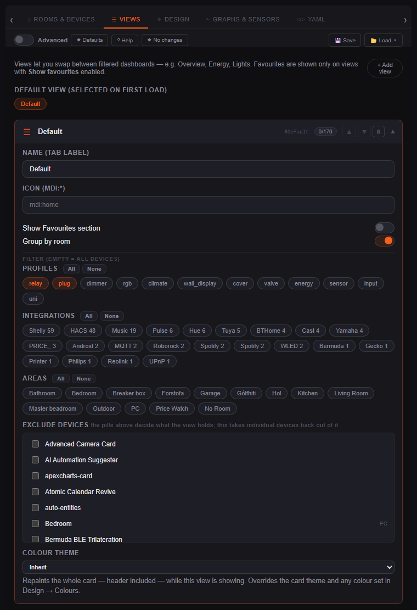
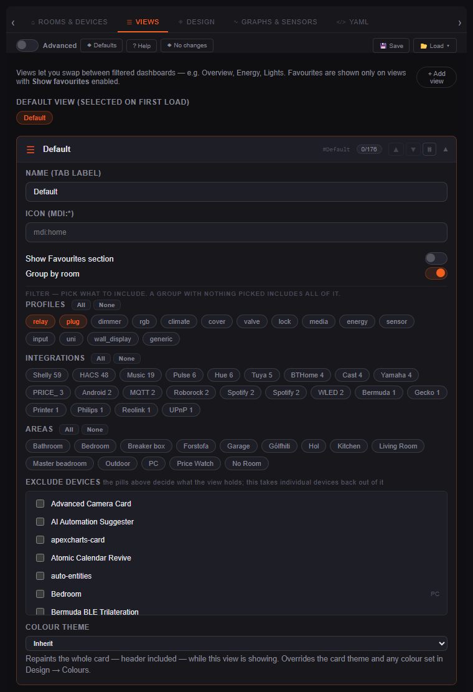

# Editor changes, before and after

The card gets screenshotted constantly. The **editor** almost never did, so
changes to it shipped on a description — "this is tidier now" — which is an
assertion rather than something you can check. This page is the check: when a
control is added, removed, relabelled or moved, the pair goes here.

Newest first. Each entry names the version it shipped in, the change, and what
to look at — because two screenshots of a dense form do not point at their own
difference.

---

## v1.6.1 — "All" in a view filter now means all

A view's **Filter** offers pills for profiles, entity domains, integrations and
rooms. Ticking them all was supposed to be the same as filtering by nothing.
It wasn't: the pill lists were hand-written and had drifted behind the code, so
"All" selected a subset and quietly hid every device of a kind that had no pill.

**What to look at:**

- The header above the pills. **`FILTER (EMPTY = ALL DEVICES)`** → **`FILTER —
  PICK WHAT TO INCLUDE. A GROUP WITH NOTHING PICKED INCLUDES ALL OF IT.`** The
  old wording said what an *empty* group does and left the direction of a
  *filled* one to be guessed — and it was guessed backwards, as an exclude list.
- The **PROFILES** row. 12 pills before, 15 after: `lock`, `media` and `generic`
  were missing, so a fully-ticked filter excluded every device of those kinds.
- Not visible here: **entity domains** had 10 of 21. That group sits behind the
  **Advanced** toggle, which is off in both shots.

Both lists now derive from the source of truth — `ALL_PROFILES` (the
`PROFILE_LABELS` keys) and `ALL_DEVICE_DOMAINS` (the `DEVICE_DOMAINS` set) in
`src/helpers.ts` — so a pill cannot go missing again, and `npm run test:card`
asserts that every pill ticked matches exactly what no filter matches.

| Before | After |
|---|---|
|  |  |

---

## How to capture a pair

The editor is a custom element, so it renders headlessly without a dashboard
around it:

```js
const ed = document.createElement('ha-device-dashboard-editor');
ed.hass = hass;
ed.setConfig(config);
document.body.appendChild(ed);
await ed.updateComplete;
ed._tab = 'views';                     // 'devices' | 'views' | 'design' | 'graphs' | 'yaml'
// accordions start closed — click the section header to open one
ed.shadowRoot.querySelectorAll('.sec-hdr')[0].click();
```

Drive it through the DevTools Protocol the same way `.tmp-shoot.mjs` drives the
card: seed `hassTokens` in localStorage on the HA origin from `.ha-token`, then
`Page.captureScreenshot` with a clip once `updateComplete` has resolved.

Three things that are easy to get wrong:

- **Take the *before* shot first**, against the bundle as it is now. Once the
  edit is made it is gone, and reconstructing it from an old `dist/` is work.
- **Use the same viewport and the same config for both**, or the diff is buried
  under reflow. Crop both to one height.
- **Read the frame before committing it.** These go in a public repo — room and
  device names are fine, an IP or a notification is not.

Images live in `docs/images/editor/`, named
`v<version>-<subject>-{before,after}.png`.
